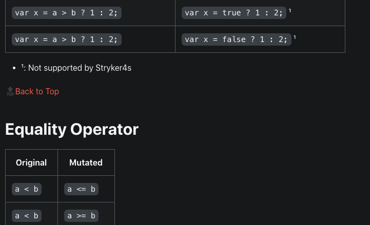
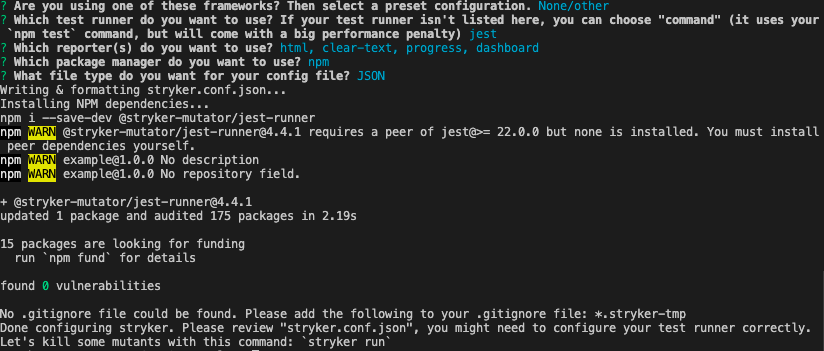
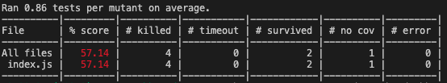
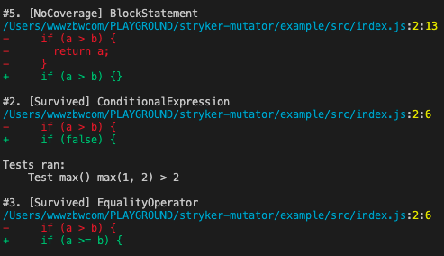
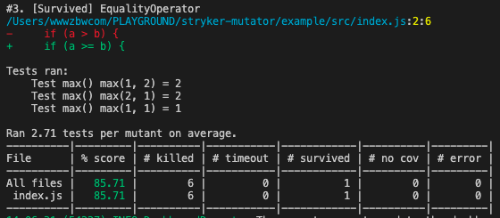

# JavaScript / TypeScript 变异测试：Stryker Mutator + Jest 实现


## 关于变异测试

前端工程化，单元测试，持续集成等近年来被越来越多的项目所接受，而我在学习前端的过程中，更是没怎么听说过变异测试相关的讯息（在学习的过程中，也鲜少看到中文社区具有相关的资料）。于是，这里就具体来讲讲变异测试是什么，我们怎么用 JavaScript 和 TypeScript 做变异测试。


### 什么是变异测试？变异测试的原理

所谓变异测试，就是通过修改我们代码中的一部分逻辑（比如将代码删除或逻辑取反），来生成一个 “变异” 的代码。然后在变异的代码上，再次运行我们的常规测试，检查常规测试能否检查出变异的存在（即变异后的代码能否通过测试）。

具体的，在[这里](https://stryker-mutator.io/docs/mutation-testing-elements/supported-mutators)我们可以看到 Stryker Mutator 的变异规则，这里是其中的一小部分：



> 以一个例子为例，如果我们的代码中，存在这样的语句：
> 
> ```bash
> if (a < b) {
>     return a;
> }
> ```
> 
> 经过 `a < b` -> `a >= b` 的变异后，就会变成 
> 
> ```bash
> if (a >= b) {
>    return a;
> }
> ```

Stryker Mutator 就是通过这些变异规则变异我们的源代码，再进行测试的。

### 为什么要做变异测试

变异测试的原理上并不复杂，不过为什么要进行变异测试呢？这是为了检查我们测试的健壮性。

虽然，我们常用代码覆盖率来检查我们的测试是否健壮，但代码覆盖率真的能反映问题吗？在编写单元测试的时候，只要运行过的代码就会被算入覆盖率的范围内，有时候，我们的断言并不能反映出问题（更极端的，甚至有时候我就忘记编写了断言，但是只要运行过，且没有发生异常，jest 就会认为我通过了测试，并只要我运行了足够多的代码，我还会获得极高的测试覆盖率）。

就如上面所说，我们的测试真的有效吗？这如果只靠测试覆盖率来判断，是完全不准确，甚至根本是和实际情况相反的。而如果进行了变异测试，变异测试程序就会发现在对我们代码进行了各种变异后（加入 bug 后），依旧完好无损的通过了测试，直接发现我们的测试程序存在严重的问题。

最后，为什么前端要做变异测试呢？前端的工作许多时候和业务联系十分紧密：例如，页面就常常会因为一些尝试性的调整（产品经理的喜好）发生大的变更。在这样的情况下，许多项目都选择甚至不做任何单元测试，通过简单的自证即可（另外的，前端出现问题要回滚，更新版本也较为容易）。

但是，随着前端涉及范围越来越广，许多基础设施类的库，工具等是很少发生变更的，并且依赖于他们的项目可能非常多，一旦这样的基础库没有做好测试，对生产环境将有很严重的影响。

当然，现在的 JavaScript / TypeScript 语言早也不仅仅局限在网页页面的范畴，可以想象在许多更为严谨的领域，一旦没有进行严谨的测试，后果将难以想象。例如 Space X 载人飞船的控制面板据传闻就利用了 Electron 进行开发，如果没有可靠的方法验证测试的完整性和程序的健壮性，可以想象宇航员们看到一个简单的页面错误时会有怎样惊恐的神情。

这些，无疑都说明了做变异测试是有意义的，那让我们来具体看看怎样做变异测试吧：

## 开始搭建变异测试

### 初始化项目

首先，我们需要在我们的 npm 项目下安装相关的依赖，具体的，有 Stryker Mutator 本身的 CLI，核心库，jest 等：

```bash
npm i -D stryker-cli @stryker-mutator/core @stryker-mutator/jest-runner jest
```

而我们可以让 stryker mutator CLI 帮助我们初始化一个项目，运行以下命令，根据实际情况选择即可：

```
npx stryker init
```

例如，我选择的如下：（没有使用框架，使用 jest 运行测试，生成所有报告，用 npm 进行包管理，使用 JSON 配置文件）



### Stryker Mutator + Jest 实现 JavaScript 变异测试

如果您是在已有项目中进行测试，可以略过这一步，但是，这里我们用一个简单的程序作为例子。

在 `/src/index.js` 下写入我们程序的函数：

```js
/** /src/index.js */
function max(a, b) {
  if (a > b) {
    return a;
  }
  return b;
}

module.exports = { max };
```

在 `/test/index.js` 下写入我们测试该程序的用例：

```js
/** /test/index.js */
const { max } = require("../src/index.js");

describe("Test max()", () => {
  test("max(1, 2) = 2", () => {
    expect(max(1, 2)).toBe(2);
  });
});
```

编写完成后，不要忘了运行一下测试，看看能否正确工作：

```bash
npx jest .
```

### 运行 Stryker Mutator

按照教程上的说明，我们只需要运行以下命令就可以进行测试了：

```bash
npx stryker run
```

最终，测试完成后，Stryker Mutator 会最终生成我们的变异测试报告：



可以看到，在我们的测试中，一共生成了 6 个变种，其中有两个都通过了我们的测试，有一个我们的测试没有覆盖到。

> 有可能运行测试时，一个变异都没有生成，最终的 score 将变成 NaN，这可能是因为我们没有告诉 Stryker Mutator 对我们的哪些代码生成变异。
> 这个时候，我们需要在 `stryker.conf.json` 中写上 `"mutate": ["<glob pattern>"]`，其中，`<glob pattern>` 是我们要进行变异的代码（也就是我们的源代码）所在的 globa pattern
> 
> 例如，对于我们现在的项目，可以写为：
>
> ```js
> {"$schema": "./node_modules/@stryker-mutator/core/schema/stryker-schema.json",
>  "packageManager": "npm",
>  "reporters": ["html", "clear-text", "progress", "dashboard"],
>  "testRunner": "jest",
>  "coverageAnalysis": "perTest",
>  "mutate": ["./src/**"]
> }
> ```


可以看到，我们的测试并不是很理想，可以看到，具体没有通过测试的变种有以下三个：



具体的，对于这些变异为什么没有被正确的测试到，我们用一个具体的例子来说明：当 Stryker Mutator 将我们的代码中的 `if(a > b)` 变异为 `if(false)`，因为我们只测试了 `max(1, 2)` 也就是 `a < b` 的情况，导致我们一样可以返回正确的结果 `b`。

这也就是变异测试的具体工作原理。


### 根据变异测试，修复测试漏洞

那么，既然变异测试为我们找到了用例中的这些问题了，就让我们来修复它吧：

```js
/** /test/index.js */
const { max } = require("../src/index.js");

describe("Test max()", () => {
  test("max(1, 2) = 2", () => {
    expect(max(1, 2)).toBe(2);
  });

  test("max(2, 1) = 2", () => {
    expect(max(2, 1)).toBe(2);
  });

  test("max(1, 1) = 1", () => {
    expect(max(1, 1)).toBe(1);
  });
});
```

在此，我们补上了三个测试用例，重新运行测试可以看到，大部分变异都顺利被杀死了：



## TypeScript 项目进行变异测试

顺道，我们也来讲一下 TypeScript 如何进行变异测试，这和 jest 运行 TypeScript 测试其实没有太大区别，让我们过一遍吧：

首先，安装相关依赖，这里我们使用 Babel 来转译 TypeScript 文件以便运行测试，这也是 Jest 官方推荐的方法：

```bash
npm i -D @types/jest @babel/core @babel/preset-env @babel/preset-typescript
```

并且，我们需要在 `babel.config.js` 写入一下内容，让 jest 利用 Babel 根据这些配置进行转译：

```js
// babel.config.js
module.exports = {
  presets: [
    ["@babel/preset-env", { targets: { node: "current" } }],
        "@babel/preset-typescript",
  ],
};
```

接下来，将 JavaScript 版本的项目程序和测试改写为 TypeScript：

项目源程序：

```ts
/** /src/index.ts */
export function max(a, b) {
  if (a > b) {
    return a;
  }
  return b;
}
```

测试程序：

```ts
/** /test/index.js */
import { max } from "../src/index";

describe("Test max()", () => {
  test("max(1, 2) = 2", () => {
    expect(max(1, 2)).toBe(2);
  });

  test("max(2, 1) = 2", () => {
    expect(max(2, 1)).toBe(2);
  });

  test("max(1, 1) = 1", () => {
    expect(max(1, 1)).toBe(1);
  });
});
```

通过 `npx jest .` 运行一下普通的测试来检查是否能正常工作，顺利后，我们运行 `npx stryker run` 就可以进行变异测试了，正常情况下，我们会得到和 JavaScript 程序一样的运行结果。